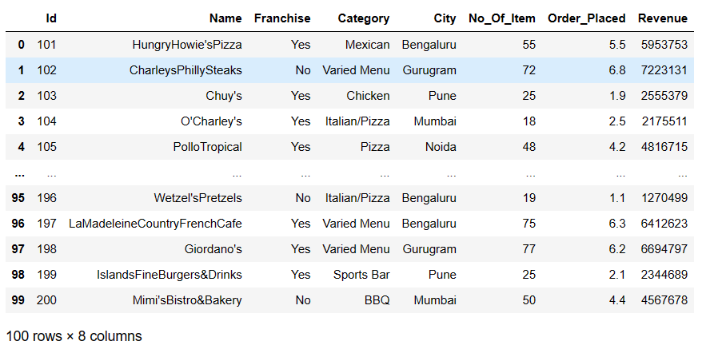
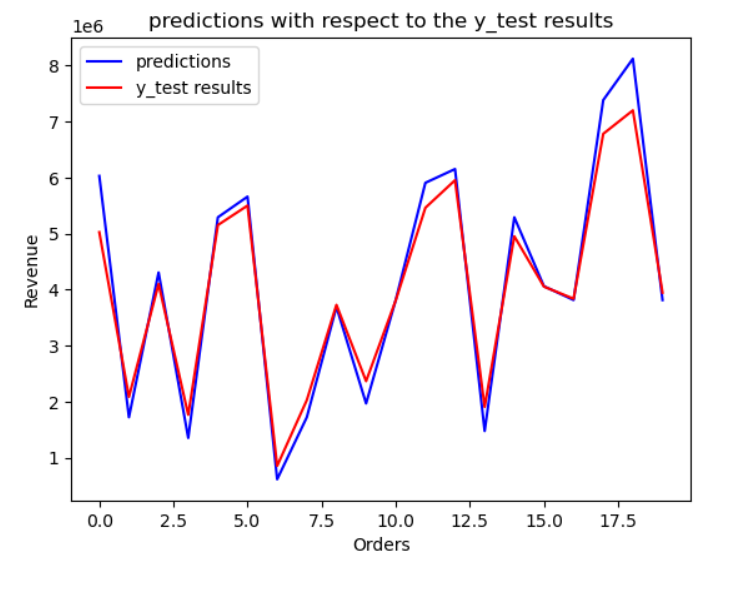

# Restaurant Revenue Prediction

## Overview

This machine learning project aims to predict the revenue of restaurants based on various features present in the dataset. The dataset contains information about 100 restaurants with 8 attributes.

## Problem Statement

Create a machine learning model to predict the revenue of a restaurant based on the features provided in the dataset.

## Dataset Attributes

1. **ID:** Restaurant ID
2. **Name:** Name of the Restaurant
3. **Franchise:** Indicates if the restaurant has a franchise
4. **Category:** Specific category provided by the restaurant
5. **No_of_item:** Different types of items provided by the restaurant
6. **Order_Placed:** Orders placed by customers at the restaurant (in lacs)
7. **Revenue:** Total amount of income generated by the restaurant

## Dataset Loading

## Plot for Predictions

### Plot Details

- X-axis: Orders
- Y-axis: Revenue
- Title: Predictions with respect to y_test results

## Linear Regression
- Divided the dataset into a train and test set (80:20 ratio).
- Built the model on the train set, predicted values on the test set.

## R2 Score

The model achieved an R-squared score of 0.9597210697647443.
